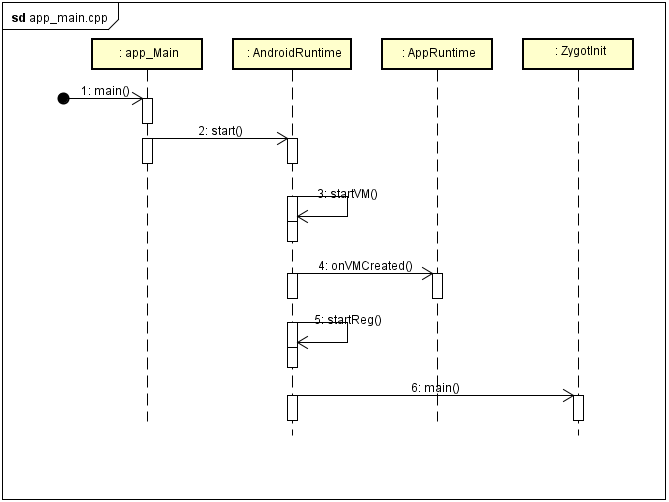
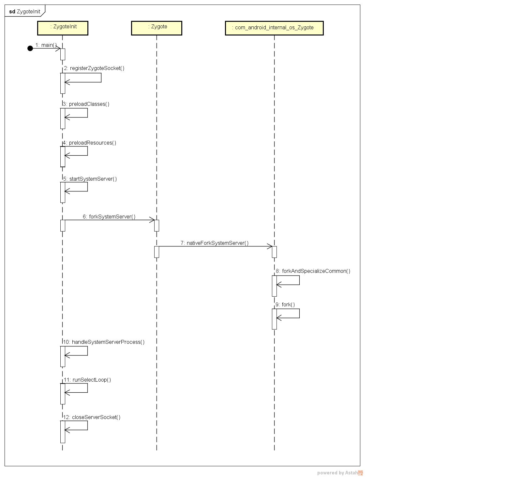

# zygot 孵化器

* [系统启动 zygote 进程](#系统启动-zygote-进程)
* [系统进入zygote进程](#系统进入-zygote-进程)
  * [启用无多线程模式](#启用无多线程模式)
  * [获取底层传入main函数的参数](#获取底层传入-main-函数的参数)
  * [注册Socket，用于进程间通信](#注册-Socket-，用于进程间通信)
  * [预加载公共类与资源](#预加载公共类与资源)
    * [预加载公共类](#预加载公共类)
    * [预加载公共资源](#预加载公共资源)
  * [停止无多线程模式](#停止无多线程模式)
  * [创建SystemServer](#创建-SystemServer)
  * [等待接受应用的socket请求](#等待接受应用的-socket-请求)
* [孵化SystemServer进程](#孵化-systemserver-进程)
* [孵化 Application 进程](#孵化-application-进程)
* [Tips](#tips)

### 系统启动 zygote 进程
即android系统的启动，分为以下几步：
- _启动电源以及系统启动_
  按下电源时，引导芯片代码开始从预定义的地方(固化在ROM)开始执行。加载引导程序Bootloader到RAM，然后执行
- _引导程序Bootloader_
  引导程序是在Android OS开始运行前的一个小程序，它的主要作用是把OS拉起来并运行
- _Linux内核启动_
  内核启动时，设置缓存，被保护存储器，加载列表，加载驱动。当内核完成系统设置，它首先在系统文件中寻找init文件，
  然后启动root进程或者系统的第一个进程
- _init进程启动_
    - 创建一些文件夹并挂载设备
    - 初始化和启动属性服务(类似win平台的注册表)
    - 解析init.rc配置文件并启动zygote进程
    
[init.rc代码启动zygote进程](http://blog.csdn.net/fu_kevin0606/article/details/53469076)

[Android初始化语言](http://blog.csdn.net/hongbochen1223/article/details/56331690)

[init.rc源码](https://github.com/StephenRJ/cm12_system_core_rootdir)，基于aosp的，是cm的，cm现在也没了。。



### 系统进入 zygote 进程
即zygote的初始化，在调用完ZygoteInit的main函数后，Zygote就进入了Java世界。


* 启用无多线程模式

  标志着孵化器开始，确保创建子线程会抛出异常
  考虑到多线程下，资源尚未加载完成的处理问题
```
ZygoteHooks.startZygoteNoThreadCreation();
```

* 获取底层传入main函数的参数
```
   boolean startSystemServer = false;
   String socketName = "zygote"; //socketName为zygote
   String abiList = null;
   for (int i = 1; i < argv.length; i++) {
       if ("start-system-server".equals(argv[i])) {
           startSystemServer = true; //start-system-server 在参数列表中，startSystemServer为true
       } else if (argv[i].startsWith(ABI_LIST_ARG)) {
           abiList = argv[i].substring(ABI_LIST_ARG.length());//设置abi列表
       } else if (argv[i].startsWith(SOCKET_NAME_ARG)) {
           socketName = argv[i].substring(SOCKET_NAME_ARG.length()); //如果参数列表指定了socketName，就重新设置socketName
       } else {
           throw new RuntimeException("Unknown command line argument: " + argv[i]);
       }
   }
```
* 注册Socket，用于进程间通信

   Socket的监听方式为使用Linux系统调用select()函数监听文件描述符，当该文件描述符上有数据时，自动触发中断，在中断处理函数中去读取文件描述符上的数据。
```
   private static void registerZygoteSocket(String socketName) {
       if (sServerSocket == null) {
           int fileDesc;
           final String fullSocketName = ANDROID_SOCKET_PREFIX + socketName;//拼接完整的socketName
           try {
               String env = System.getenv(fullSocketName);//获取环境变量
               fileDesc = Integer.parseInt(env);
           } catch (RuntimeException ex) {
               throw new RuntimeException(fullSocketName + " unset or invalid", ex);
           }
   
           try {
               FileDescriptor fd = new FileDescriptor();
               fd.setInt$(fileDesc);//设置文件描述符
               sServerSocket = new LocalServerSocket(fd);
           } catch (IOException ex) {
               throw new RuntimeException(
                       "Error binding to local socket '" + fileDesc + "'", ex);
           }
       }
   }
```
   
   

* 预加载公共类与资源

    在Android系统中有很多的公共资源，所有的程序都会用到。而Zygote创建应用程序进程过程，其实就是复制自身进程地址空间作为应用程序进程的地址空间，因此在Zygote中
    加载的类和资源都可以由Zygote孵化的应用程序共享。因此可以在Zygote中加载公共类与资源，当某个应用程序启动时，只要加载自身特有的类与资源即可，可以提高软件的启动速度。
    代价是增加了系统重启的时间。
    
```

    static void preload() {
        Log.d(TAG, "begin preload");
        Trace.traceBegin(Trace.TRACE_TAG_DALVIK, "BeginIcuCachePinning");
        beginIcuCachePinning();
        Trace.traceEnd(Trace.TRACE_TAG_DALVIK);
        Trace.traceBegin(Trace.TRACE_TAG_DALVIK, "PreloadClasses");
        preloadClasses();
        Trace.traceEnd(Trace.TRACE_TAG_DALVIK);
        Trace.traceBegin(Trace.TRACE_TAG_DALVIK, "PreloadResources");
        preloadResources();
        Trace.traceEnd(Trace.TRACE_TAG_DALVIK);
        Trace.traceBegin(Trace.TRACE_TAG_DALVIK, "PreloadOpenGL");
        preloadOpenGL();
        Trace.traceEnd(Trace.TRACE_TAG_DALVIK);
        preloadSharedLibraries();
        preloadTextResources();
        // Ask the WebViewFactory to do any initialization that must run in the zygote process,
        // for memory sharing purposes.
        WebViewFactory.prepareWebViewInZygote();
        endIcuCachePinning();
        warmUpJcaProviders();
        Log.d(TAG, "end preload");
    }
```
  
  * 预加载公共类
```

    /**
     * The path of a file that contains classes to preload.
     * 预加载类的文件路径
     */
    private static final String PRELOADED_CLASSES = "/system/etc/preloaded-classes";
    private static final int UNPRIVILEGED_GID = 9999;
    private static final int ROOT_UID = 0;
    
    private static void preloadClasses() {
        final VMRuntime runtime = VMRuntime.getRuntime();

        InputStream is;
        try {
            is = new FileInputStream(PRELOADED_CLASSES);//将classes文件转变为文件输入流
        } catch (FileNotFoundException e) {
            Log.e(TAG, "Couldn't find " + PRELOADED_CLASSES + ".");
            return;
        }

        Log.i(TAG, "Preloading classes...");
        long startTime = SystemClock.uptimeMillis();//开始预加载的时间

        // Drop root perms while running static initializers.
        // 运行静态初始化时，废弃root权限
        final int reuid = Os.getuid();
        final int regid = Os.getgid();

        // We need to drop root perms only if we're already root. In the case of "wrapped"
        // processes (see WrapperInit), this function is called from an unprivileged uid
        // and gid.
        // 已经root的设备我们需要废弃root权限。
        boolean droppedPriviliges = false;
        if (reuid == ROOT_UID && regid == ROOT_GID) {
            try {
                Os.setregid(ROOT_GID, UNPRIVILEGED_GID);
                Os.setreuid(ROOT_UID, UNPRIVILEGED_UID);
            } catch (ErrnoException ex) {
                throw new RuntimeException("Failed to drop root", ex);
            }

            droppedPriviliges = true;//废弃root特权
        }

        // Alter the target heap utilization.  With explicit GCs this
        // is not likely to have any effect.
        float defaultUtilization = runtime.getTargetHeapUtilization();
        runtime.setTargetHeapUtilization(0.8f);

        try {
            BufferedReader br
                = new BufferedReader(new InputStreamReader(is), 256);//classes文件输入流封装成BufferReader

            int count = 0;
            String line;
            while ((line = br.readLine()) != null) {
                // Skip comments and blank lines.
                // 过滤空行
                line = line.trim();
                if (line.startsWith("#") || line.equals("")) {
                    continue;
                }

                Trace.traceBegin(Trace.TRACE_TAG_DALVIK, "PreloadClass " + line);
                try {
                    if (false) {
                        Log.v(TAG, "Preloading " + line + "...");
                    }
                    // Load and explicitly initialize the given class. Use
                    // Class.forName(String, boolean, ClassLoader) to avoid repeated stack lookups
                    // (to derive the caller's class-loader). Use true to force initialization, and
                    // null for the boot classpath class-loader (could as well cache the
                    // class-loader of this class in a variable).
                    // 加载并且明确地初始化指定的类
                    // 使用反射避免重复的栈查找
                    // true用来强制初始化
                    // null表示使用根路径的类加载器
                    Class.forName(line, true, null);
                    count++;
                } catch (ClassNotFoundException e) {
                    Log.w(TAG, "Class not found for preloading: " + line);
                } catch (UnsatisfiedLinkError e) {
                    Log.w(TAG, "Problem preloading " + line + ": " + e);
                } catch (Throwable t) {
                    Log.e(TAG, "Error preloading " + line + ".", t);
                    if (t instanceof Error) {
                        throw (Error) t;
                    }
                    if (t instanceof RuntimeException) {
                        throw (RuntimeException) t;
                    }
                    throw new RuntimeException(t);
                }
                Trace.traceEnd(Trace.TRACE_TAG_DALVIK);
            }

            Log.i(TAG, "...preloaded " + count + " classes in "
                    + (SystemClock.uptimeMillis()-startTime) + "ms.");//打印预加载时间
        } catch (IOException e) {
            Log.e(TAG, "Error reading " + PRELOADED_CLASSES + ".", e);
        } finally {
            IoUtils.closeQuietly(is);
            // Restore default.
            runtime.setTargetHeapUtilization(defaultUtilization);

            // Fill in dex caches with classes, fields, and methods brought in by preloading.
            // 用预加载的类，字段，方法填充dex缓存空间。
            Trace.traceBegin(Trace.TRACE_TAG_DALVIK, "PreloadDexCaches");
            runtime.preloadDexCaches();
            Trace.traceEnd(Trace.TRACE_TAG_DALVIK);

            // Bring back root. We'll need it later if we're in the zygote.
            // 恢复root权限。如果在zygote中，待会儿要用。
            if (droppedPriviliges) {
                try {
                    Os.setreuid(ROOT_UID, ROOT_UID);
                    Os.setregid(ROOT_GID, ROOT_GID);
                } catch (ErrnoException ex) {
                    throw new RuntimeException("Failed to restore root", ex);
                }
            }
        }
    }
```

  * 预加载公共资源

```
    /**
     * Used to pre-load resources.  We hold a global reference on it so it
     * never gets destroyed.
     * 用来预加载资源。对其持有全局引用，因此永远不会被销毁。
     */
    private static Resources mResources;
    private static void preloadResources() {
        final VMRuntime runtime = VMRuntime.getRuntime();

        try {
            mResources = Resources.getSystem();
            mResources.startPreloading();
            if (PRELOAD_RESOURCES) {
                Log.i(TAG, "Preloading resources...");

                long startTime = SystemClock.uptimeMillis();
                TypedArray ar = mResources.obtainTypedArray(
                        com.android.internal.R.array.preloaded_drawables);//要预加载的资源
                int N = preloadDrawables(ar); //预加载drawables
                ar.recycle();
                Log.i(TAG, "...preloaded " + N + " resources in "
                        + (SystemClock.uptimeMillis()-startTime) + "ms.");//预加载drawables使用的时间

                startTime = SystemClock.uptimeMillis();
                ar = mResources.obtainTypedArray(
                        com.android.internal.R.array.preloaded_color_state_lists);
                N = preloadColorStateLists(ar);//预加载color state
                ar.recycle();
                Log.i(TAG, "...preloaded " + N + " resources in "
                        + (SystemClock.uptimeMillis()-startTime) + "ms.");//预加载color state使用的时间

                //The device supports freeform window management. Windows have title bars and can be moved
                //and resized. If you set this to true, you also need to add
                //PackageManager.FEATURE_FREEFORM_WINDOW_MANAGEMENT feature to your device specification.
                //The duplication is necessary, because this information is used before the features are
                //available to the system.
                if (mResources.getBoolean(
                        com.android.internal.R.bool.config_freeformWindowManagement)) {
                        //如果支持自由的窗口管理，预加载多窗口drawables
                    startTime = SystemClock.uptimeMillis();
                    ar = mResources.obtainTypedArray(
                            com.android.internal.R.array.preloaded_freeform_multi_window_drawables);
                    N = preloadDrawables(ar);
                    ar.recycle();
                    Log.i(TAG, "...preloaded " + N + " resource in "
                            + (SystemClock.uptimeMillis() - startTime) + "ms.");
                }
            }
            mResources.finishPreloading();
        } catch (RuntimeException e) {
            Log.w(TAG, "Failure preloading resources", e);
        }
    }
```
* 停止无多线程模式
```
   ZygoteHooks.stopZygoteNoThreadCreation();
```
* 创建SystemServer

```
  if (startSystemServer) {   //startSysteServer为true  
      startSystemServer(abiList, socketName);     
  } 
```
  [孵化 SystemServer 进程](#孵化 SystemServer 进程)

* 等待接受应用的socket请求

```
    private static void runSelectLoop(String abiList) throws MethodAndArgsCaller {
        ArrayList<FileDescriptor> fds = new ArrayList<FileDescriptor>();
        ArrayList<ZygoteConnection> peers = new ArrayList<ZygoteConnection>();

        fds.add(sServerSocket.getFileDescriptor());
        peers.add(null);

        while (true) {
            StructPollfd[] pollFds = new StructPollfd[fds.size()];
            for (int i = 0; i < pollFds.length; ++i) {
                pollFds[i] = new StructPollfd();
                pollFds[i].fd = fds.get(i);
                pollFds[i].events = (short) POLLIN;
            }
            try {
                Os.poll(pollFds, -1);
            } catch (ErrnoException ex) {
                throw new RuntimeException("poll failed", ex);
            }
            for (int i = pollFds.length - 1; i >= 0; --i) {
                if ((pollFds[i].revents & POLLIN) == 0) {
                    continue;
                }
                if (i == 0) {
                    ZygoteConnection newPeer = acceptCommandPeer(abiList);
                    peers.add(newPeer);
                    fds.add(newPeer.getFileDesciptor());
                } else {
                    boolean done = peers.get(i).runOnce();
                    if (done) {
                        peers.remove(i);
                        fds.remove(i);
                    }
                }
            }
        }
    }
```


### 孵化 SystemServer 进程
 

### 孵化 Application 进程
 

### Tips   
- 为所有Java程序复刻一个虚拟机实例
- 应用程序的入口是`ActivityThread$main()`，而zygote就是为应用程序创建进程的
- 大部分应用程序由zygote创建进程，但是系统引导进程、init进程不是
  #### android中的zygote分两块
  1. C/C++编写的zygote，主要用来为系统服务和应用程序复刻进程的
  2. Java编写的zygote接口，负责为系统服务和应用程序调用C/C++ zygote接口执行复刻，创建虚拟机进程
  
  #### android中的service分两种
  1. NativeService
  2. SystemService，即本project示例集所研究